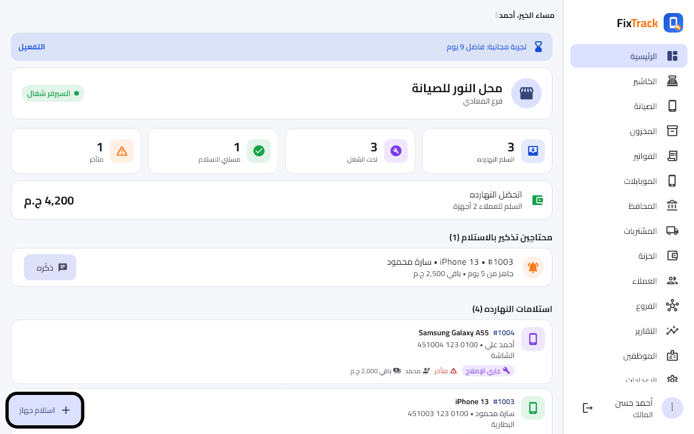
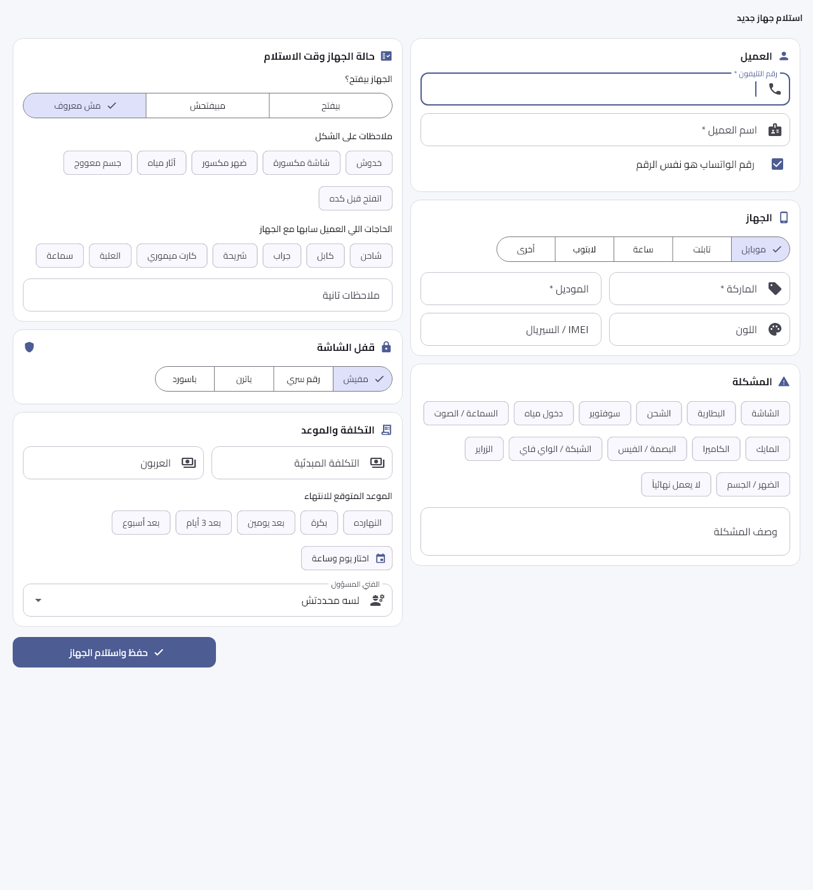
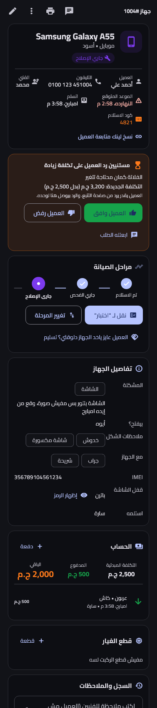
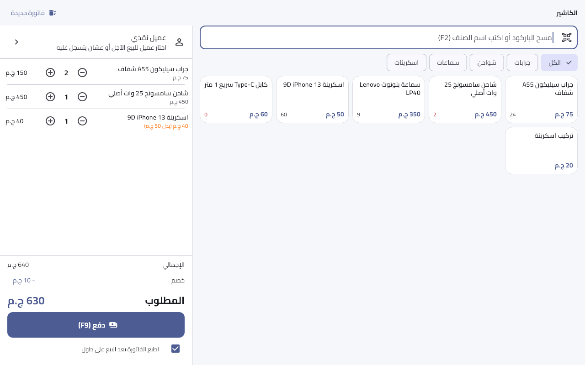
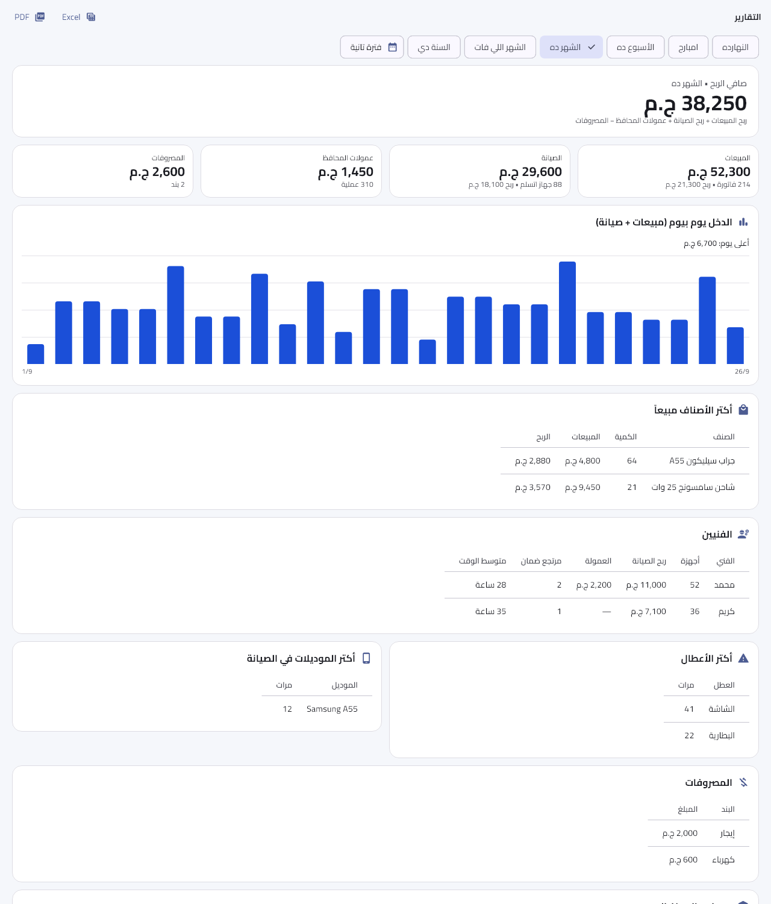
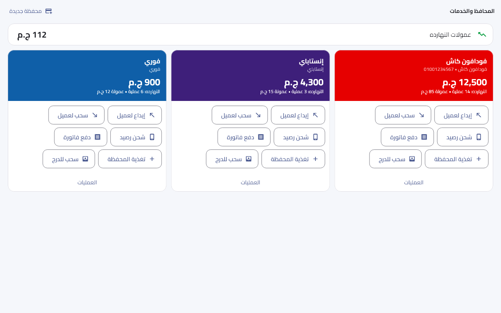
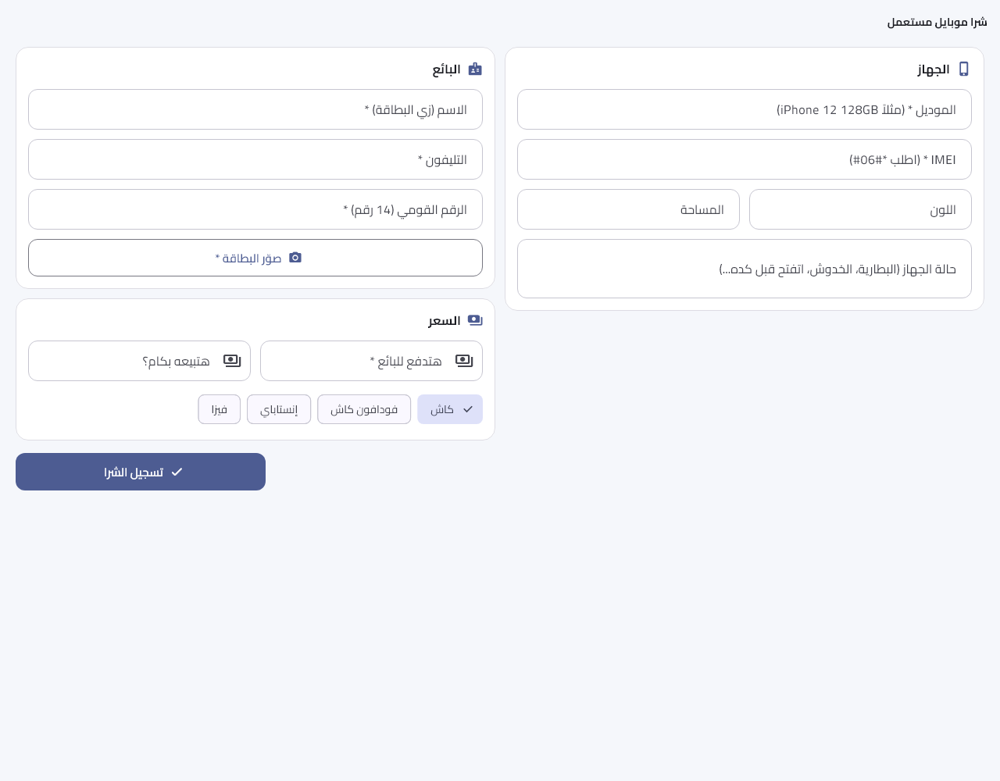
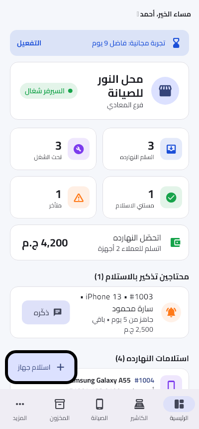
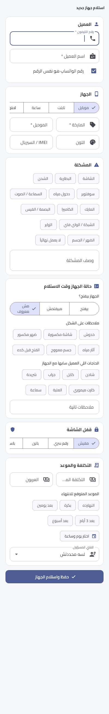
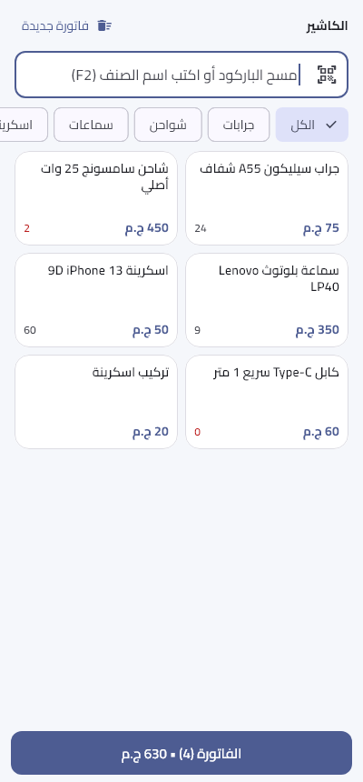

<div align="center">


# FixTrack

**Phone repair shop & POS management — Windows + Android, offline-first**

نظام متكامل لإدارة محلات صيانة وبيع الموبايلات: صيانة + كاشير + مخزون + تقارير + فروع


</div>

<p align="center">
  
</p>

## What is it?

FixTrack replaces the generic cashier software that phone shops in Egypt run today. One app handles
the **repair workflow** (intake → stages → customer approval → delivery with warranty) **and** the
**shop counter** (accessories by barcode, new phones by IMEI, buying used phones, mobile-wallet and
recharge services), with reports for the owner.

The shop's Windows PC is the server: it runs a local HTTP server inside the desktop app, and every
Android phone in the shop connects to it over Wi-Fi. Everything keeps working without internet.
The cloud (Firebase free tier) is used only for the customer tracking page and for linking branches.

## Features

| Area | What it does |
|---|---|
| **Repairs** | Device intake with customer, fault, photos and PIN; stages (received → diagnosing → waiting approval → repairing → ready → delivered); parts per ticket; technician assignment & commissions; repair warranty and warranty returns |
| **Receipts & tracking** | Printed receipt (80/58 mm ESC/POS thermal printers or A4/PDF) with a QR code → customer tracks the repair online and approves the cost |
| **Messages** | WhatsApp (pre-filled `wa.me`, no ban risk) and automatic SMS from the shop's Android SIM; pickup reminders after 3/7/14/30 days |
| **POS / cashier** | Barcode scanning (USB scanner or phone camera), sales invoices & returns, customer credit & collection, cash drawer sessions with expenses and day close |
| **Phones** | New phones tracked per IMEI, used-phone purchase with national-ID photo and seller declaration, IMEI history check |
| **Wallets & services** | Vodafone Cash / InstaPay / recharge / bills with commission tracking and drawer effects |
| **Inventory & purchases** | Products, stock moves, suppliers, purchase invoices, barcode labels, **Excel/CSV import with column mapping** from the shop's old program |
| **Reports** | Owner dashboard, sales/repairs/profit reports with Excel and PDF export |
| **Branches** | Link branches through Firestore: day summaries, cross-branch stock lookup and transfers |
| **Users & security** | Roles (owner, reception, technician), audit log, PIN delivery, daily zip backups + restore |
| **Licensing** | Ed25519-signed offline activation codes, 14-day trial, device limit, clock-tamper check |

## Screenshots

| Repair intake | Repair details (phone, dark) | Cashier |
|---|---|---|
|  |  |  |

| Reports | Wallets | Buying a used phone |
|---|---|---|
|  |  |  |

<p align="center">
  
  &nbsp;
  
  &nbsp;
  
</p>

## Architecture

```
            ┌───────────────────── Shop (LAN, works offline) ─────────────────────┐
            │                                                                     │
  Android ──┼──► Windows PC: FixTrack desktop app                                 │
  phones    │      ├─ Flutter UI                                                  │
  (Wi-Fi)   │      └─ shelf HTTP server (isolate) ── SQLite ── daily zip backups  │
            └───────────────┬─────────────────────────────────────────────────────┘
                            │ only when online
                            ▼
                Firebase (free Spark plan)
                ├─ Hosting: customer tracking page (QR) + user guide
                └─ Firestore: approvals, pickup booking, branch sync
```

- **Flutter 3.47** single codebase, **Riverpod 3** state management
- **shelf** server running in a background isolate, raw **sqlite3** with `user_version` migrations
- Own lightweight XLSX reader/writer and PDF export, ESC/POS printing
- Bundled fonts and assets (no runtime downloads) so it runs on old/low-end devices

## Project layout

```
source/                 the FixTrack app (Windows + Android)
  lib/src/server/       local API server, database, auth, licensing
  lib/src/features/     screens: tickets, pos, inventory, phones, services, reports, branches…
  firebase/             tracking page + Firestore rules
  installer/            Inno Setup script (Windows installer)
  test/                 72 server/API tests
  test_cloud/           live Firestore tests (branches)
  test_visual/          screenshot tests (images above)
license-maker/          owner-only tool that signs activation codes (needs the private key, not in this repo)
```

## Build & run

```bash
cd source
flutter pub get
flutter run -d windows        # desktop app (also the shop server)
flutter test                  # 72 tests
flutter build apk --release   # Android app
```

The Windows installer is built with `source/tool/build_release.ps1` (Inno Setup).
Signing keys (`android/key.properties`, keystore, `license-private.key`) are intentionally **not** in the repository.

---

## بالعربي

**FixTrack** برنامج لمحلات صيانة وبيع الموبايلات، شغال على **ويندوز وأندرويد**. بيغني المحل عن برنامج الكاشير القديم:

- **الصيانة:** استلام الجهاز، ومراحل الشغل، وموافقة العميل على التكلفة، والتسليم بالضمان، وعمولة الفني.
- **إيصال فيه QR:** العميل بيتابع جهازه من الموبايل، وبيوصله واتساب أو SMS أول ما الجهاز يجهز.
- **الكاشير:** بيع بالباركود، وموبايلات جديدة بالـIMEI، وشراء موبايلات مستعملة بصورة البطاقة، وفودافون كاش والشحن.
- **المخزون:** الموردين وفواتير الشراء، ونقل الأصناف من البرنامج القديم بملف Excel.
- **التقارير والفروع:** تقارير لصاحب المحل بتتصدر Excel أو PDF، وربط بين الفروع.

كمبيوتر المحل هو السيرفر، والموبايلات بتتصل بيه على نفس الواي فاي، فالبرنامج **شغال من غير إنترنت**.
